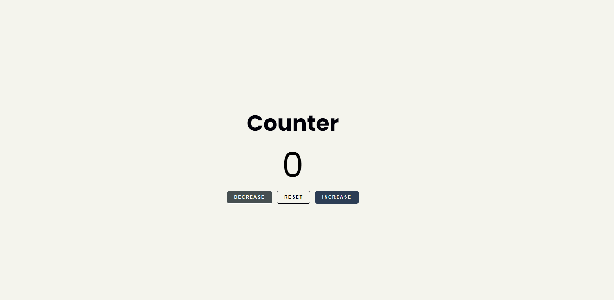
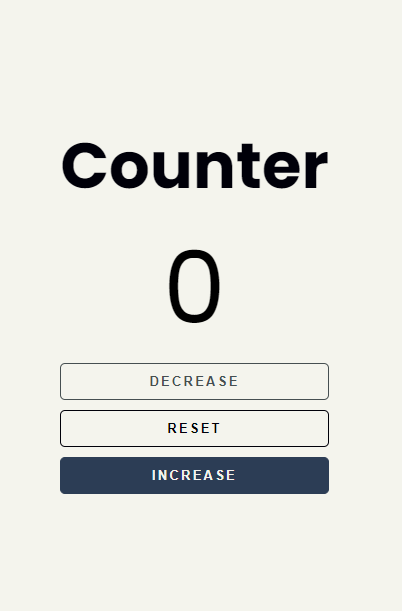

# Frontend Mentor - Counter Project

This is a solution to a self-initiated project inspired by a freeCodeCamp tutorial. While I didn't code along with the tutorial, I drew inspiration from it to create my own version of a counter application, which allowed me to practice and apply my HTML, CSS, and JavaScript skills.

## Table of contents

- [Overview](#overview)
  - [Screenshot](#screenshot)
  - [Links](#links)
- [My process](#my-process)
  - [Built with](#built-with)
  - [What I learned](#what-i-learned)
  - [Continued development](#continued-development)
- [Author](#author)
- [Acknowledgments](#acknowledgments)

## Overview

### Screenshot




### Links

- Solution URL: [(https://github.com/jiehlarae/Counter.git)]
- Live Site URL: [(https://jiehlarae.github.io/Counter/)]

## My process

### Built with

- Semantic HTML5 markup
- CSS custom properties
- Flexbox
- JavaScript for interactivity

### What I learned

Working on this project helped me reinforce my understanding of DOM manipulation using JavaScript. Here’s a snippet of the code I’m proud of:

```js
decreaseBtn.addEventListener('click', function () {
    count--;
    p.innerText = count;
    updateColor();
});
```

I also explored using CSS custom properties and practiced designing responsive layouts using Flexbox.

### Continued development

I plan to continue focusing on improving my JavaScript skills, especially in manipulating the DOM and handling user interactions. Additionally, I want to explore more complex CSS layouts and design techniques.

### Author

- *Github:* [@jiehlarae](https://github.com/jiehlarae)
- *X:* [@JiehlaDacara](https://x.com/JiehlaDacara)

## Acknowledgments

I got the initial idea for this project from a [freeCodeCamp tutorial](https://www.youtube.com/watch?v=3PHXvlpOkf4&t=1825s). 
